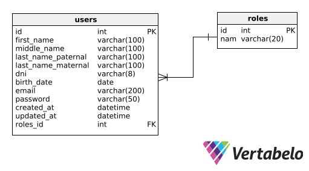

# Database Diagram

This document presents the database design for our system. The diagram illustrates the main tables, their fields, and the relationships between them.

## Overview

The data model is designed to support functionalities such as:

- User management with roles.
- Attendance recording and querying.
- Attendance report generation.

## ER Diagram

Below is the Entity-Relationship (ER) diagram of the database:

